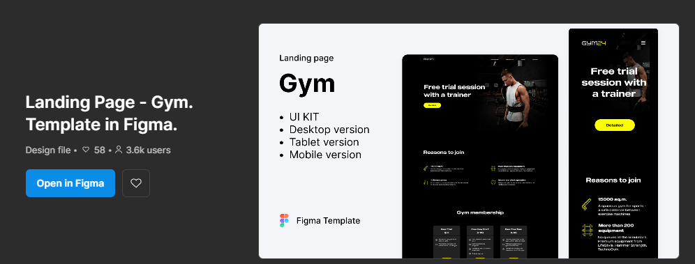

# GYM24

This project was made by the design found in figma by VEHA

<a href="https://www.figma.com/community/file/1260888393015798147/landing-page-gym-template-in-figma" target="_blank">
   Design in Figma
</a>
  

> 🧑‍🚀 **Preview design in Figma**

The link shows the following

This project was created with Astro, Tailwind CSS, for an Astro learning experience.
The page was designed to be responsive, so I need a better design for tablets.
